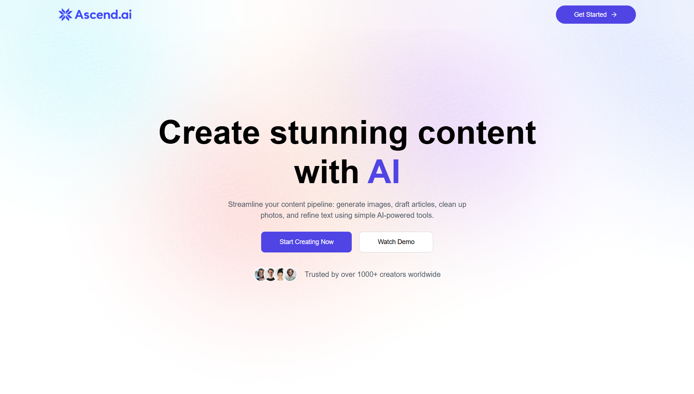
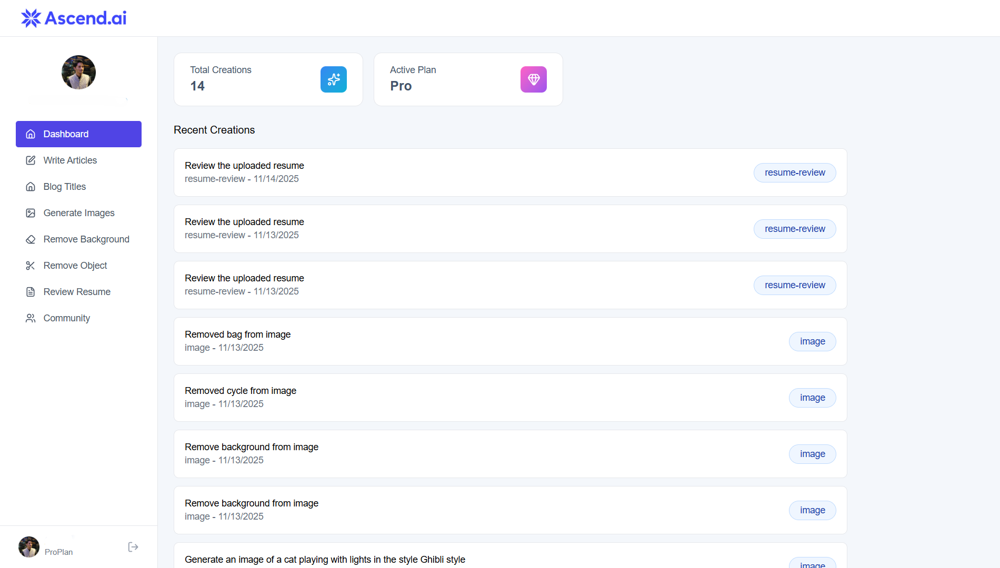

<div align="center">

# 🚀 AscendAI

### AI-Powered Content Creation Platform

_Elevate your content creation with intelligent AI tools for writing, image generation, and document analysis._

[](https://ascend-ai-2025.vercel.app/)
[](https://reactjs.org/)
[](https://reactjs.org/)
[](https://vitejs.dev/)
[](https://vitejs.dev/)
[](https://tailwindcss.com/)
[](https://tailwindcss.com/)
[](https://clerk.com/)
[](https://clerk.com/)

[](#)
[](#)
[](#)
[](#)
[](#)
[](#)
[](#)
[](#)
[](#)
[](#)
[](#)
[](#)


</div>

---

## 📋 Overview

**AscendAI** is a comprehensive AI-powered platform that streamlines content creation workflows. From generating blog posts and titles to creating stunning images and analyzing resumes, AscendAI empowers creators with cutting-edge artificial intelligence tools. Built with modern web technologies and featuring a freemium model with Clerk-powered subscription management.

---

## 📸 Screenshots

<table>
  <tr>
    <td align="center"><b>Home</b></td>
    <td align="center"><b>Dashboard</b></td>
  </tr>
  <tr>
    <td></td>
    <td></td>
  </tr>
</table>

---

## ✨ Key Features

### 📝 Content Writing

- ✍️ **AI Article Generator** - Create full-length articles with customizable length
- 📰 **Blog Title Generator** - Generate catchy, SEO-friendly blog titles
- 🎯 Smart prompts with AI-powered content generation
- 📊 Usage tracking and history

### 🎨 Image Tools (Pro)

- 🖼️ **AI Image Generation** - Create unique images from text descriptions
- 🔲 **Background Removal** - Remove backgrounds with one click
- ✂️ **Object Removal** - Intelligently remove unwanted objects
- 🌐 **Community Gallery** - Share and discover AI-generated art
- ❤️ Like and interact with community creations

### 📄 Document Analysis (Pro)

- 📋 **Resume Review** - AI-powered resume analysis and feedback
- 💡 Constructive feedback on strengths and weaknesses
- 🎯 Professional recommendations

### 💎 Subscription Management

- 🆓 **Free Tier** - 10 free AI generations per month
- 💰 **Pro Plan** - Unlimited access to all features
- 🔐 Clerk-powered authentication and subscription
- 💳 Integrated pricing table with Stripe payments

---

## 🛠️ Tech Stack

### Frontend

- ⚡ **React 19.1** - Modern UI library
- 🏃 **Vite 7.1** - Lightning-fast build tool
- 🎨 **Tailwind CSS 4.1** - Utility-first styling
- 🔐 **Clerk React** - Authentication & user management
- 🎭 **React Router 7.9** - Client-side routing
- 📝 **React Markdown** - Markdown rendering
- 🔥 **React Hot Toast** - Elegant notifications
- 🎨 **Lucide React** - Modern icon library

### Backend

- 🚀 **Express 5.1** - Node.js web framework
- 🤖 **OpenAI 6.8** - AI text generation (Gemini API)
- ☁️ **Cloudinary** - Image hosting & transformation
- 🗄️ **Neon Serverless** - PostgreSQL database
- 🔐 **Clerk Express** - Server-side authentication
- 📄 **PDF Parse** - Resume document analysis
- 📤 **Multer** - File upload handling
- 🌐 **Axios** - HTTP client

---

## 📦 Dependencies

<details>
<summary>Click to expand full dependency list</summary>

### Client Dependencies

```json
{
  "@clerk/clerk-react": "^5.53.7",
  "@tailwindcss/vite": "^4.1.16",
  "axios": "^1.13.2",
  "lucide-react": "^0.552.0",
  "react": "^19.1.1",
  "react-dom": "^19.1.1",
  "react-hot-toast": "^2.6.0",
  "react-markdown": "^10.1.0",
  "react-router": "^7.9.5",
  "tailwindcss": "^4.1.16"
}
```

### Server Dependencies

```json
{
  "@clerk/express": "^1.7.46",
  "@neondatabase/serverless": "^1.0.2",
  "axios": "^1.13.2",
  "cloudinary": "^2.8.0",
  "cors": "^2.8.5",
  "dotenv": "^17.2.3",
  "express": "^5.1.0",
  "multer": "^2.0.2",
  "openai": "^6.8.1",
  "pdf-parse": "^1.1.1"
}
```

</details>

---

## 🚀 Getting Started

### Prerequisites

- Node.js 18+ installed
- Clerk account for authentication
- Gemini API key (or OpenAI compatible API)
- Cloudinary account for image hosting
- Neon PostgreSQL database
- Clipdrop API key (for image generation)

### Installation

1. **Clone the repository**

   ```bash
   git clone https://github.com/Purab2001/AscendAI.git
   cd AscendAI
   ```

2. **Install dependencies**

   ```bash
   # Install client dependencies
   cd client
   npm install

   # Install server dependencies
   cd ../server
   npm install
   ```

3. **Set up environment variables**

   **Client** - Create `.env` in the `client` folder:

   ```env
   VITE_CLERK_PUBLISHABLE_KEY=your_clerk_publishable_key
   VITE_BASE_URL=http://localhost:3000
   ```

   **Server** - Create `.env` in the `server` folder:

   ```env
   # Clerk Authentication
   CLERK_PUBLISHABLE_KEY=your_clerk_publishable_key
   CLERK_SECRET_KEY=your_clerk_secret_key

   # Database
   DATABASE_URL=your_neon_database_url

   # Gemini/OpenAI API
   GEMINI_API_KEY=your_gemini_api_key

   # Cloudinary
   CLOUDINARY_CLOUD_NAME=your_cloudinary_cloud_name
   CLOUDINARY_API_KEY=your_cloudinary_api_key
   CLOUDINARY_API_SECRET=your_cloudinary_api_secret

   # Clipdrop (Image Generation)
   CLIPDROP_API_KEY=your_clipdrop_api_key

   # Server
   PORT=3000
   ```

4. **Set up the database**

   Run the SQL schema provided in `server/configs/db.js` on your Neon database to create the required tables.

5. **Run the development servers**

   ```bash
   # Terminal 1 - Run server
   cd server
   npm run server

   # Terminal 2 - Run client
   cd client
   npm run dev
   ```

6. **Open your browser**

   Navigate to [http://localhost:5173](http://localhost:5173)

### Building for Production

```bash
# Build client
cd client
npm run build

# Start server
cd ../server
npm start
```

---

## 🎯 Usage

### Free Users

1. Sign up with Clerk authentication
2. Get 10 free AI generations per month
3. Generate articles and blog titles
4. View your creation history

### Pro Users

1. Subscribe to Pro plan via pricing page
2. Unlimited AI text generation
3. Access image generation tools
4. Use background and object removal
5. Get AI-powered resume reviews
6. Share creations in community gallery

---

## 📁 Project Structure

```
AscendAI/
├── client/                 # React frontend
│   ├── public/            # Static assets
│   ├── src/
│   │   ├── assets/        # Images and icons
│   │   ├── components/    # Reusable components
│   │   ├── pages/         # Page components
│   │   ├── App.jsx        # Root component
│   │   └── main.jsx       # Entry point
│   └── package.json
│
├── server/                # Express backend
│   ├── configs/          # Configuration files
│   │   ├── cloudinary.js # Cloudinary setup
│   │   ├── db.js         # Database connection
│   │   └── multer.js     # File upload config
│   ├── controllers/      # Route controllers
│   │   ├── aiController.js
│   │   └── userController.js
│   ├── middlewares/      # Custom middleware
│   │   └── auth.js       # Authentication
│   ├── routes/           # API routes
│   │   ├── aiRoutes.js
│   │   └── userRoutes.js
│   ├── server.js         # Entry point
│   └── package.json
│
└── README.md
```

---

## 🔒 Security

- 🛡️ Clerk-powered authentication
- 🔐 Secure API key management
- 🚫 Rate limiting on free tier
- ✅ Server-side validation
- 🔒 Protected API routes

---

## 🌐 Deployment

### Frontend (Vercel)

```bash
cd client
vercel --prod
```

### Backend (Vercel)

```bash
cd server
vercel --prod
```

Configure environment variables in Vercel dashboard.

---

## 🤝 Contributing

Contributions are welcome! Please feel free to submit a Pull Request.

1. Fork the repository
2. Create your feature branch (`git checkout -b feature/AmazingFeature`)
3. Commit your changes (`git commit -m 'Add some AmazingFeature'`)
4. Push to the branch (`git push origin feature/AmazingFeature`)
5. Open a Pull Request

---

## 📝 License

This project is open source and available under the [MIT License](LICENSE).

---

## 📧 Contact

**Purab** - [@Purab2001](https://github.com/Purab2001)

Project Link: [https://github.com/Purab2001/AscendAI](https://github.com/Purab2001/AscendAI)

---

<div align="center">

### Made with ❤️ by [Purab](https://github.com/Purab2001)

⭐ Star this repo if you find it helpful!

</div>
